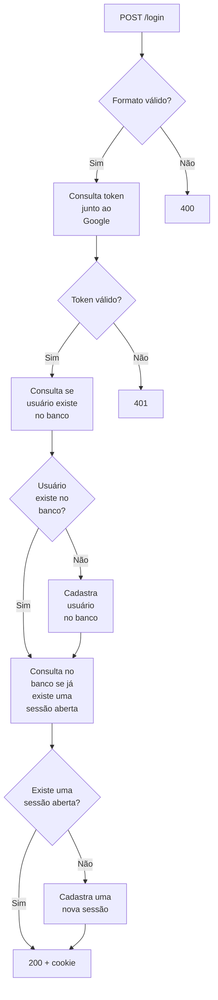
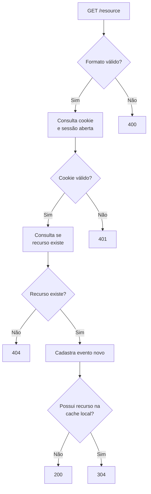
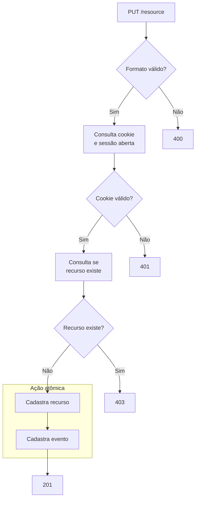
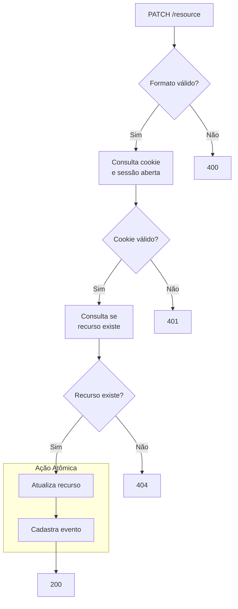
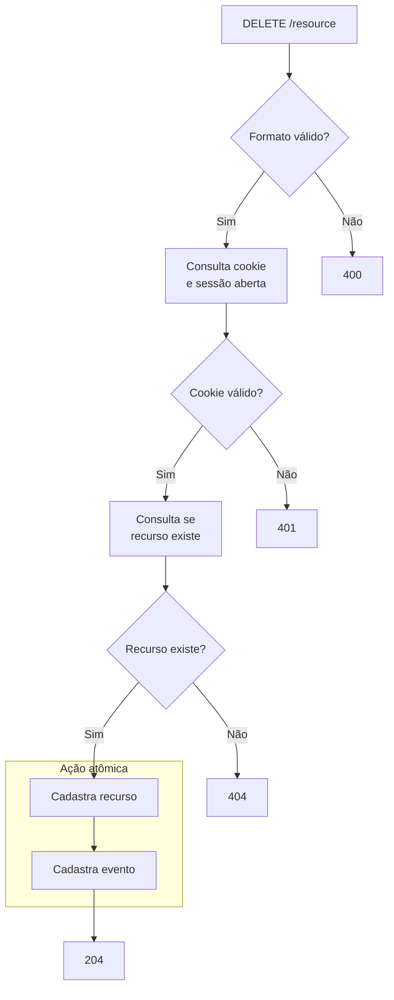
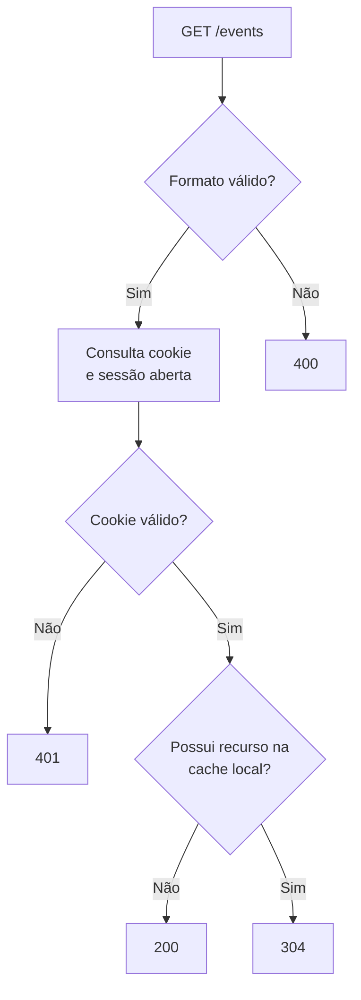
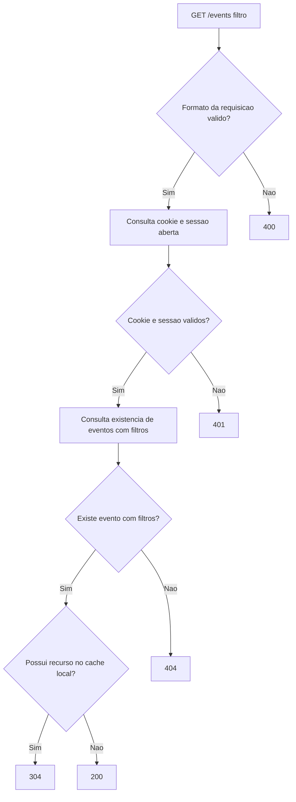

# Projeto de Extensão 2
	
## 1. Como executar o Projeto:

- Clonar o repositório:  
`git clone https://github.com/Extensao2/extensao-server.git`

- Iniciar a execução:  
`make start`
- Interromper a execução:  
`make stop`

## 2. Premissa do Projeto:

Construir uma API robusta para uma plataforma de estudos não-linear, possibilitando que o usuário a pesquise conteúdos e presonalize sua jornada de aprendizagem seguindo suas preferências e necessidades.
	
## 3. Referências do Projeto:

- [Roadmap.sh](https://roadmap.sh/)
- [The Odin Project](https://www.theodinproject.com/)
- [FreeCodeCamp](https://www.freecodecamp.org/)

## 4. Fluxo das rotas:

`POST /login`:

---

`GET /resource`:

---

`PUT /resource`:

---

`PATCH /resource`:

---

`DELETE /resource`:

---

`GET /events`:

---

`GET /events (com filtro)`:

